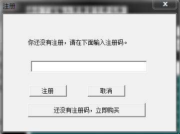
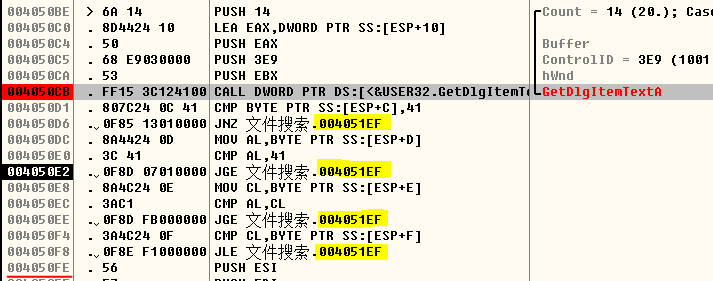
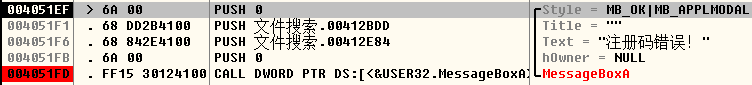
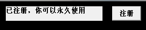

##破解步骤

### 打开软件后单击`注册`按钮后弹出窗口要求输入注册码：

### 下断点
获取输入框文本的API是`GetDlgItemTextA`, 在OD中`Ctrl+N`后找到它, 下断点, F9运行. 随意输入一个字符串后单击注册窗口的`注册`按钮后命中断点:

### 分析
那一连串的`cmp`和各种跳转指令就是在校验注册码, 可以看到所有的跳转都指向同一个地方:

正是注册码错误的提示弹窗. 如果不进行跳转, 那末将会执行位于`004050FE`处的`push esi`等一系列指令, 这正是检验正确后的操作. 如果能在`call GetDlgItemTextA`后避开校验而直接跳转过去就可以破解!

### 破解: 修改程序码
`call GetDlgItemTextA`之后的指令起始地址是`004050D1`, 目标地址是`004050FE`, 跳转偏移是`004050FE-004050D1-5=0x28`, 则跳转指令机器码为`E9 28 00 00 00`, 使用UltraEdit打开exe文件, 修改:

完成破解:

## More
注册码校验成功后该程序会创建系统级隐藏文件`C:\135.txt`, 并向写入字符`D`. 实际上每次启动时它都会创建读取该文件(如果不存在则创建它), 并读取其中内容进行校验, 校验失败则表明软件为注册, 并提示`未注册, 你还可以使用几次`; 只要一次注册成功, `C:\135.txt`就会包含正确的内容, 从而提示`已注册, 你可以永久使用`(如上图).
### `C:\135.txt`作为系统级隐藏文件, 只能通过`DeleteFile`这个API删除