### 该程序启动后弹出对话框要求进行注册：

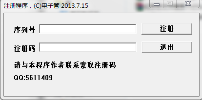

**目前仅知道该程序用汇编语言编写.**

### OD分析时发现该程序将API调用隐藏起来了，所以看不到与对话框相关的API:

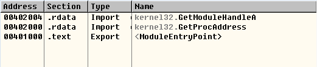

### 在程序开始我发现：

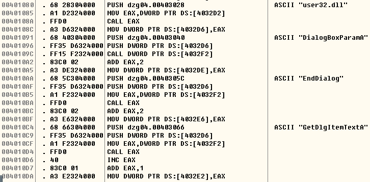

**由此猜测：程序必然使用了特殊手段调用被隐藏的一系列API**

### 跟踪调试：

**首先通过`jmp`调用`GetModuleHandleA`, 获得`kernel32.dll`地址:**

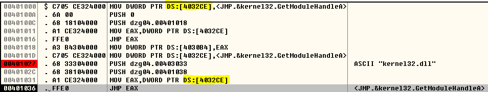

**接着准备好`GetProcAddress`的入口地址，以便后续调用:**

**通过`LoadLibrary`获取`user32.dll`的地址后调用`GetProcAddress`获取函数地址:**

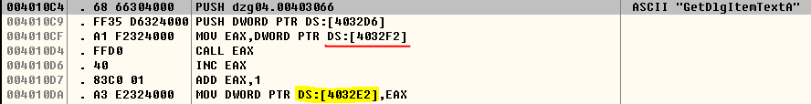

**由上图可知，获取到`GetDlgItemTextA`的地址后将其后移2字节, 因为所有系统API入口出都有`mov edi,edi`的“废话”，跳过它并无大碍，然而却使得OD无法识别被调用的系统API. 最后将修改函数入口地址放在`ds:4032E2`处. 对于其他API也是同样的处理.**

### 那么问题是，如何在调用`GetDlgItemTextA`的地方下断点？我只能猜测，既然前面把`GetDlgItemTextA`的地址放在了`ds:4032E2`, 需要调用时也许会`mov eax,ds:[4032E2]`, 然后`jmp eax`(因为前面调用`GetModuleHandleA`就是这样的). 在OD中搜索指令`jmp eax`(右键-Search for-All commands), 结果如下:**

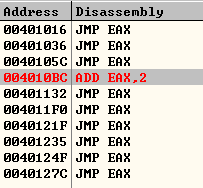

**一个一个地看，最后可以找到调用`GetDlgItemTextA`的`jmp eax`:**

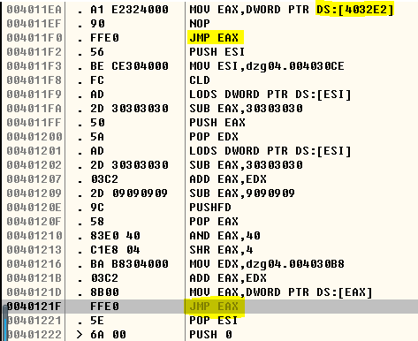

**下断点后输入注册码，点击"注册"后命中之.**

### 跟踪调试时发现，上图底下那个`jmp eax`有问题，不能让他正确地跳到他想去的地方，否则注册码校验失败. 那么应该跳到哪呢？我完全不知道. 但是在程序开头处我发现程序获取过`MessageBox`的地址，并用同样的方法将其保存下来，那么先跳过去看看会弹个什么样的窗.

**定位到`MessageBox`调用处，那些`push`是在传递参数，所以跳转的目的地址应该是第一个`push`处. 把`40121F`的`jmp eax`换掉:**

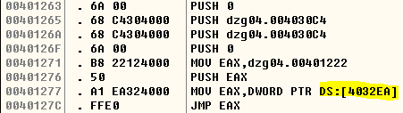

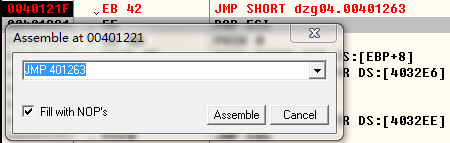

**然而窗口上没有东西:**

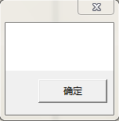

**其实为`MessageBox`传参的前面还有，这段指令向字符串缓冲区`004030C4`填充字符串:**

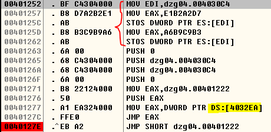

**修改跳转指令:**

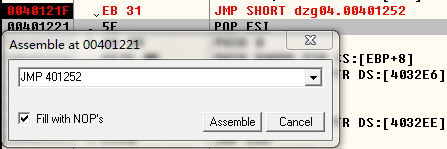

**弹窗告诉我，注册成功:**

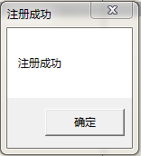

