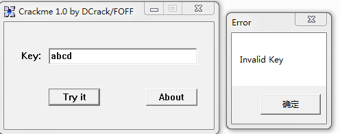
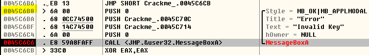
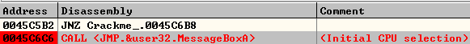
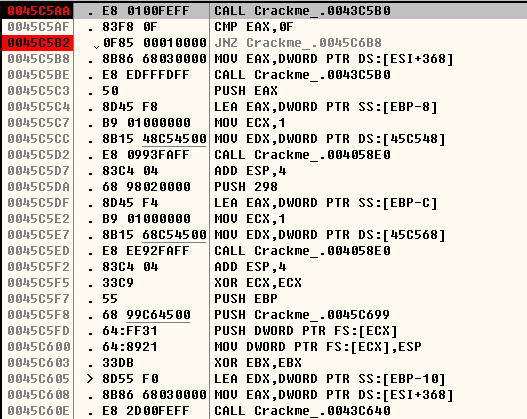
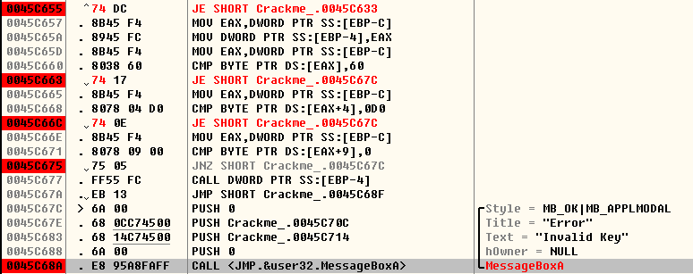

**输入无效注册码后弹窗如下：**

**试图拦截`GetDlgItemText`和`GetWindowText`，未果；拦截`MessageBox`则成功命中断点:**

**那么如何追踪到前面校验注册码的代码？注意到为`MessageBoxA`传参的第一个`push`位于`0045C6B8`，观察上下文可知，要调用此处的`MessageBoxA`，可能要在某处通过`jnz`之类的条件转移指令，不妨搜索一下`jnz 0045C6B8`，结果令人欣慰:**

**下断点，Ctrl+F2重启，命中断点:**

**尝试将`jnz`改为`jz`:**

**修改后F9继续运行, 最终还是提示注册码无效. 随后我找到了所有跳转到调用`MessageBoxA`以显示"Invalid key"的`jnz`, 将其中最后一个外的所有均改为`jz`(在输入无效注册码的情况下，最后一个`jnz`不会跳到`MessageBoxA`):**

**可是最终那个`CALL DWORD PTR SS:[EBP-4]`内存访问违规. 可以断定，爆破是不行的，必须找到正确的key**

> 这个CrackMe的加密解密算法挺复杂的，看雪上有详解: [http://bbs.pediy.com/thread-60058.htm](http://bbs.pediy.com/thread-60058.htm)

