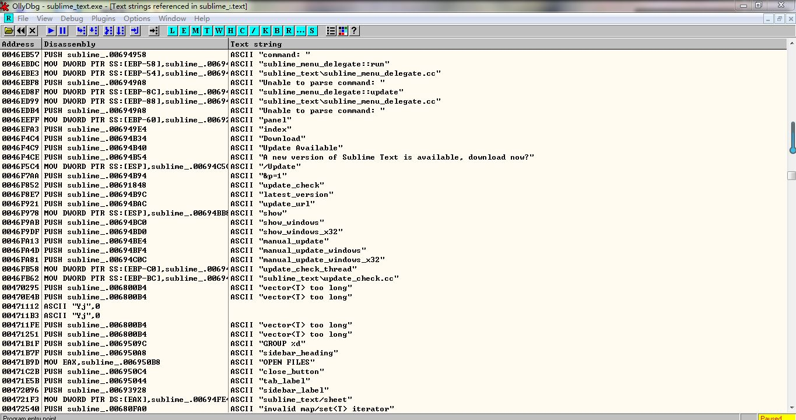
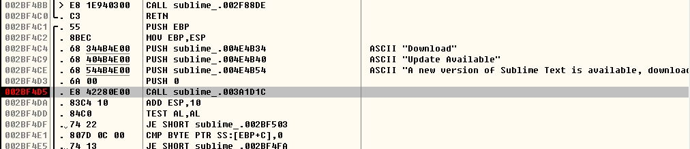
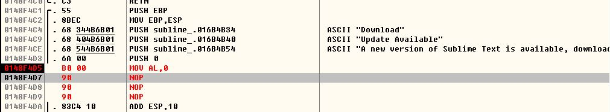

# 破解 sublime 启动时的更新提示弹窗
sublime 启动后会弹出一个更新提示对话框，我搜索到的解决方案均无效，遂决定通过逆向工程破解之

## 思路一
程序应该使用了`CreateWindow`, `ShowWindow`, `CreateDialog`之类的API, 若能截获相关API调用就能阻止弹窗. 结果发现，`CreateWindow`和`ShowWindow`只与主窗口有关，而`CreateDialog`根本未使用.

## 思路二
若能在程序的代码段中找到弹窗包含的字符串，就能定位到相应位置. 在OD中搜索字符串，确实找到了，如图：

之后下断点，如图：

可见，将参数压栈后调用了一个函数，后面的`ADD ESP,10`恢复栈，然后`TEST AL,AL`——显然是在判断函数的返回值是否为0，由此推断，函数应该返回一个布尔值. 首先，我在UltraEdit中定位到相应位置后，将`call`指令用`NOP`填充，重启后发现虽然没弹窗，但是他居然自动开始下载更新了. 回顾，发现使用`NOP`填充后`AL`不为0，便尝试添加`MOV AL,0`，如图：

在UltraEdit中修改，重启，弹窗果然消失了.