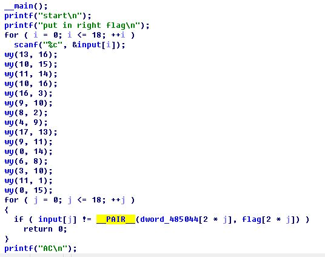
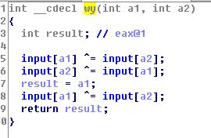
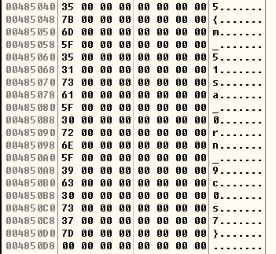
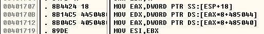
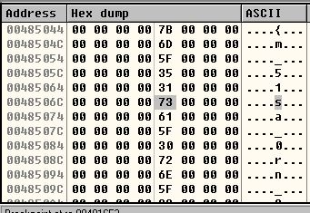
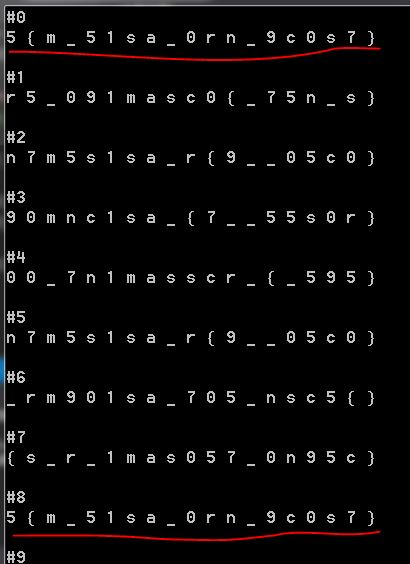
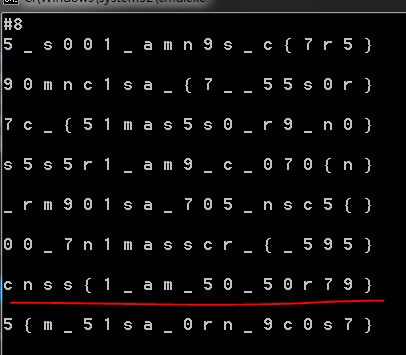
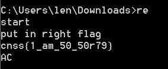

# 解题过程

拿到的源程序经upx压缩加壳，需使用`upx -d file_name`解压去壳

## step1
使用IDA查看加密逻辑，如图:

可见，获取输入后，使用`wy`函数进行了加密变换，然后再for循环中进行校验.
反编译`wy`，如图:

这是基于异或的加密算法.

循环校验时用到一个函数宏（IDA将函数宏标记为`__PAIR__`)，IDA似乎无法反编译函数宏，故需使用OD查看其执行逻辑.

## step2
使用OD动态调试，同时查看加密flag的内容，如图：

可知，加密flag为`5{m_51sa_0rn_9c0s7}`，然而`flag`数组中每隔一个字符添一个0，有效字符只是`flag[j * 2], j = 0,1,2,...,18`，因此前面提到的函数宏的参数数组的索引为`j * 2`. 用OD跟踪函数宏，发现：

_图1_

_图2_

对照IDA可知，函数宏的第一个参数是`flag`数组中为0的"列"，第二个参数是有效字符组成的"列". 参与校验的还有`input`数组，继续跟踪可以得出函数宏的逻辑.

# step3
关键在于破译step2中找到的密文. 源程序调用了多次`wy`，而且参数无规律，加之异或操作的复杂性，显然不可能像对待凯撒密码那样人工破译. 能否通过编程得出一个类似密码本的东西？由于加密参数有两个，而且每次加密对之后的加密结果都有影响，因此不存在密码本的一一对应关系. 可是我突然想到，最少连续两次异或后可以复原，即: 设 `C = A XOR B`, 则 `A = C XOR B`; 那末，倘若对一个字符串连续多次调用`wy`加密，是否在第n次加密后又还原到原始字符串呢？经验证，确实可以.

如图为test1.exe的输出：

**接下来开始破译!**

将上图#7标注的的字符串作为test2.exe的输入，运行结果：

试将`cnss{1_am_50_50r79}`作为源程序的输入，校验成功：

**至此，破译成功，校验使用的函数宏究竟是干什么的我就不管了.**